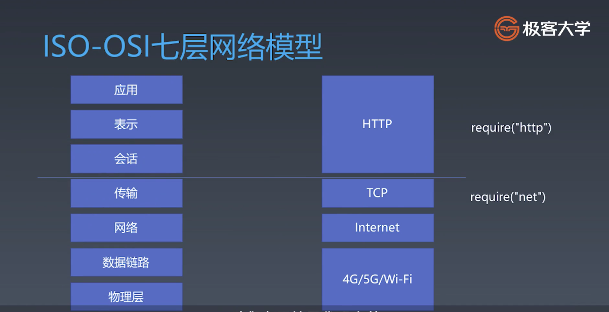

# 学习笔记 Week 08

## 浏览器工作原理

URL =(HTTP)=> HTML =(parse)=> DOM =(css computing)=> DOM with CSS =(layout)=> DOM with position =(render)=> Bitmap

### 有限状态机

- 每一个状态都是一个机器
- 每一个机器知道下一个状态

```
// 不使用状态机处理字符串
// 不使用正则、JS api，在一个字符串中，找到字符“a”

function match(str) {
  for(let c of str) {
    if(c === "a") {
      return true
    }
  }
  return false
}

match("sjsjak sdasdk")


// 不使用正则、JS api，在一个字符串中，找到字符“ab”

function findChar(str) {
  let foundA = false
  for( let chars of str) {
    if(chars === 'a') {
      foundA = true
    } else if(foundA && chars === 'b') {
      return true
    } else {
      foundA = false
    }
  }
  return false
}

findChar('sabjkjk')
findChar('good a')


```

```
// 使用状态机处理字符串
// 用状态机实现：字符串“abcabx”的解析

function matchChar(str) {
        let state = start
        for(let chars of str) {
          state = state(chars)
        }
        return state === end
      }

      function start(chars) {
        if(chars === "a") {
          return foundA
        } else {
          return start
        }
      }

      function end(chars) {
        return end
      }

      function foundA(chars) {
        if(chars === "b") {
          return foundB
        } else {
          return start(chars)
        }
      }
      function foundB(chars) {
        if(chars === "c") {
          return foundC
        } else {
          return start(chars)
        }
      }
      function foundC(chars) {
        if(chars === "a") {
          return foundA2
        } else {
          return start(chars)
        }
      }
      function foundA2(chars) {
        if(chars === "b") {
          return foundB2
        } else {
          return start(chars)
        }
      }
      function foundB2(chars) {
        if(chars === "x") {
          return end
        } else {
          return foundB(chars)
        }
      }

matchChar('aabcabxd')
matchChar('aabccabxd')
matchChar('abcabcabcabx')

```
### ISO-OSI七层网络模型



### TCP/IP的一些知识
- 流
- 端口
- require('net')
- 包
- IP地址
- libnet/libcap

### HTTP请求

- Request
- Response

Request格式

```
// POST/HTTP/1.1   				--- Request line ---
// HOST:127.0.0.1                          --- headers 行数不固定，空行结束---
// Content-Type:application/x-www-form-unlencoded --- headers 行数不固定，空行结束---

// field1=aaa&code=x%3D1       --- body ---
```

Response格式

```
// HTTP/1.1 200 OK            --- status line , 协议版本，状态码 ---
// Content-Type:text/html              --- headers 行数不固定，空行结束---
// Date:Fri, 18 Dec 2020 15:42:17 GMT  --- headers 行数不固定，空行结束---
// Connection: keep-alive              --- headers 行数不固定，空行结束---
// Keep-Alive: timeout=5               --- headers 行数不固定，空行结束---
// Transfer-Encoding: chunked          --- headers 行数不固定，空行结束---

// 26                                     --- body, 格式由content-type 决定 ---
// <html><body>Hello World!</body></html> --- body, 格式由content-type 决定 ---
// 0                                      --- body, 格式由content-type 决定 ---


```


#### 第一步 HTTP请求总结

- 设计一个 HTTP 请求类
- content-type 是一个必要的字段，要有默认值
- body 是 Key-Value 格式
- 不同的 content-type 影响 body 的格式


#### 第二步 send函数总结

- 在 Request 的构造函数中收集必要的信息
- 设计一个send函数，把请求真实发送到服务器
- send函数是异步的，返回Promise


#### 第三步 发送请求

- 设计支持已有的 connection 或者自己新建 connection
- 收到数据传给 parser
- 根据 parser 的状态 resolve Promise

#### 第四步 response解析

- Response 必须分段构造，所以我们要用一个 ResponseParser 来“装配”
- ResponseParser 分段处理 ResponseText，用状态机来分析文本结构

#### 第五步 BodyParser

- Response 的 body 可能根据 content-type 有不同的结构，因此采用 子Parser 的结构来解决问题
- 以 TrunkedBodyParser 为例，用状态机来处理 body 格式
