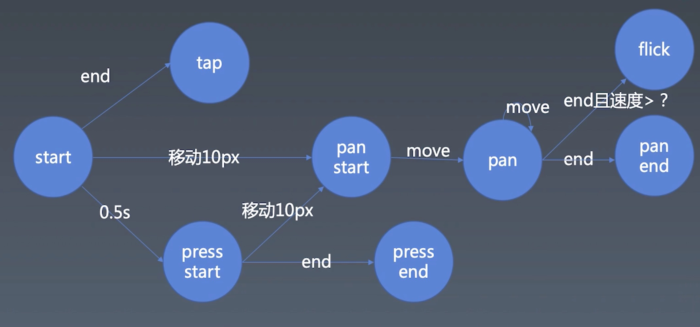

# 学习笔记
第 15 周的课程，手把手完善动画时间线部分，还实现通用的手势库。

## 动画、时间线

JavaScript 动画，使用 requestAnimationFrame() 。与 setTimeout()/setInterval() 相比，使用requestAnimationFrame() 调用自身的时间线来实现动画，效率更高。

从 demo 实例及大多数场景下, JavaScript 动画和基于 CSS 的动画表现差不多。

## 手势库的实现

明晰了手势的基本知识，结合鼠标和触摸屏的差异性，兼顾鼠标和触摸两种交互，封装成通用的兼容手势库。拆分成listen（监听）、recognize（识别）、dispatch（分发）三个过程。

整个过程对于组件的抽象、业务逻辑处理，有很大的帮助。

