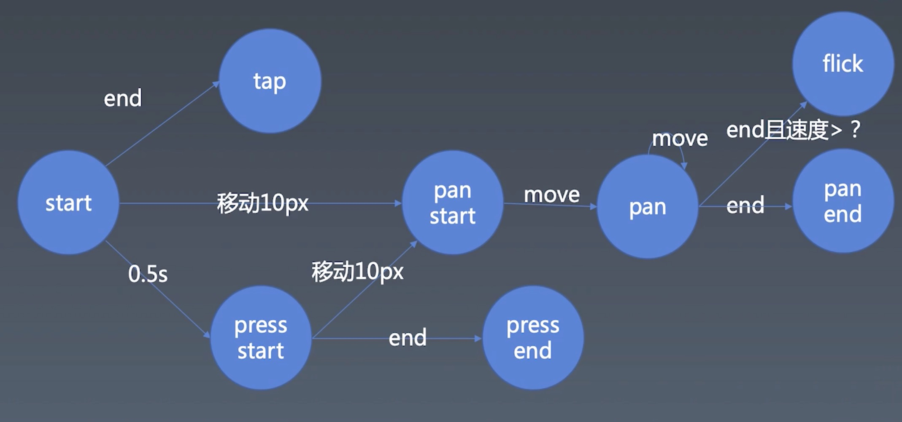

# 学习笔记
第 16 周的课程，加上前两周的课程，手把手打造轮播图组件，完善动画、通用手势库，整个过程对于组件的抽象、业务逻辑处理，有很大的帮助，有时间还需要深入思考。

## 组件基础知识

对象：Properties、Methods、Inherit
组件：Properties、Childern、Inherit、Attribute、Config & State、Event、Lifecycle、Children

区分 attributes 和 property ，有重合和不同的地方

**如何设计组件状态**
- Property：不可以被 Markup（标记语言）设置，可以被 JS 设置和改变，有可能会根据用于输入而改变
- Attribute：可以被 Markup 设置，可以被 JS 设置和改变，有可能会根据用户输入而改变
- State：只会根据用户输入而改变
- Config：JS 去配置（一般是全局的，由构造函数传入，不会被修改）

**Lifecycle 生命周期**
组件生命周期，从 create（创建）到 destroyed（销毁），中间会有挂载、卸载、响应去更新等。

**Children 自组件**
- Content 型 Children ，组件树
- Template 型 Children ，模版语法

#### JSX 语法和打造Framwork

事无巨细一步一步地带领打造 createELement 的 Framwork 。使用 @babel/plugin-transform-react-jsx 库来解析 JSX，使用 Webpack 配置进行打包。

#### Carousel 轮播图组件

跟上节奏，完成了定时轮播和手动切换的轮播图。确实是比预想的要复杂很多，需要沉下心去涉及到计算的部分。当然，实际应用还得完善和拓展，增加可配置项目（模式切换、duration）等。

## 动画、时间线

JavaScript 动画，使用 requestAnimationFrame() 。与 setTimeout()/setInterval() 相比，使用requestAnimationFrame() 调用自身的时间线来实现动画，效率更高。

从 demo 实例及大多数场景下, JavaScript 动画和基于 CSS 的动画表现差不多。

## 手势库的实现

明晰了手势的基本知识，结合鼠标和触摸屏的差异性，兼顾鼠标和触摸两种交互，封装成通用的兼容手势库。拆分成listen（监听）、recognize（识别）、dispatch（分发）三个过程。整个过程对于组件的抽象、业务逻辑处理，有很大的帮助。

